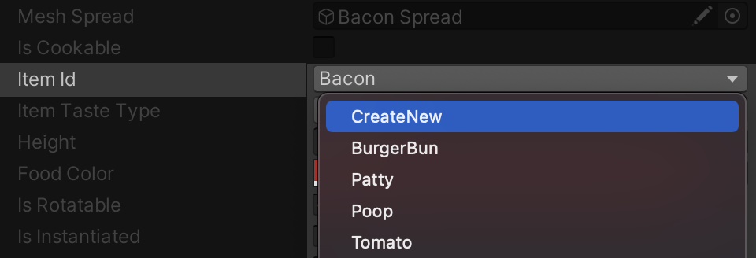

[Home](../readme.md)

# Enum Generation

This component will help you to generate an **Enum Item** from Editor.

To use this component, add the Enum Generator Attribute to the targeted Enum Field as showing below,
```csharp
[SerializeField, EnumGenerator(typeof(ItemID), "Assets/Scripts/Items/ItemID.cs")]
private ItemID m_ItemId;
```

Here, the targeted Enum is `ItemID`. In `enumFile:`, add the path of the Enum.

Now you can add a new enum field from the editor!




