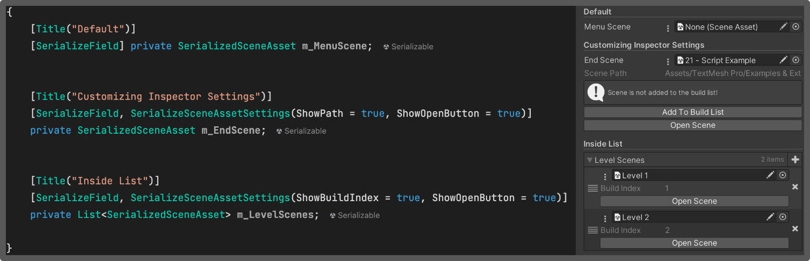

[Home](../readme.md)

# Scene Serialization

Use datatype **SerializedSceneAsset** instead of **SceneAsset** because SceneAsset is not 
available in the build.

```csharp
[SerializedField] private SerializedSceneAsset m_MenuScene;
.
.
.
SceneLoader.Instance.LoadSceneAsync(m_MenuScene.BuildIndex)
```
### SerializedSceneAsset
- public members
  - BuildIndex : int

Use attribute **SerializedSceneAssetSettings** to show additional information in the inspector

```csharp
[SerializeSceneAssetSettings(ShowOpenButton = true, Paths = "Assets/Scenes/")]
[SerializeField] private SerializedSceneAsset m_MenuScene;
```

### SerializedSceneAssetSettingsAttribute
- Public Members
  - ShowOpenButton : bool
  - ShowScenePath : bool
  - ShowBuildIndex : bool
  - Paths : string 
    <br>use `|` to separate multiple paths. Example `Paths = "Assets/Levels/ | Assets/Scenes/`

<br>

