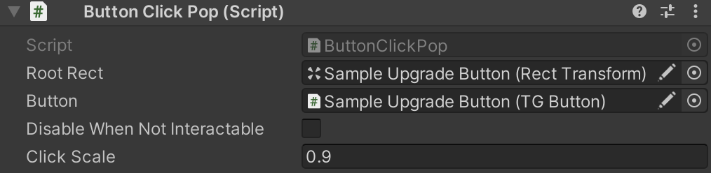

[Home](../readme.md)

# Button Click Pop

Attach this component to an UI Element to have a pop animation while pressed.
Add the `Root Rect` and the `Button` like the reference image below and that's it!

