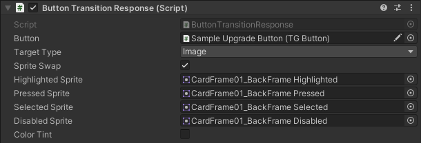
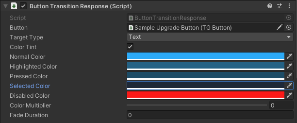
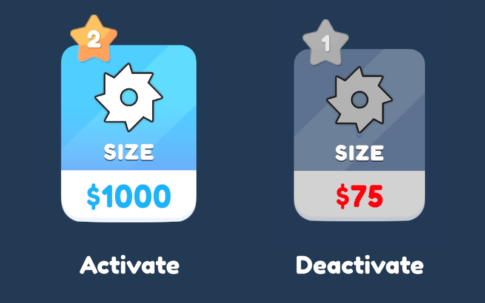

[Home](../readme.md)

# Button Transition Response

Attach this component to an Image or a TextMeshProUGUI to have its own sprites or colors for  different SelectionState (Normal, Pressed, Disable, etc)
  

Here is a button which has multiple UI elements in it.

To make a disable state for this button, follow instructions given below,
1. Attach `Button Transition Response` component to each Image and TextMeshProUGUI.
2. Assign the button to which it should response. Make sure the button is `TGButton`, not regular `UI Button`.
3. For Image, choose `TargetType` as `Image` and assign the sprites it should follow for different SelectionState.

4. For TMP, choose `TargetType` as `Text` and assign the colors it should follow for different SelectionState.

And this is the result!

